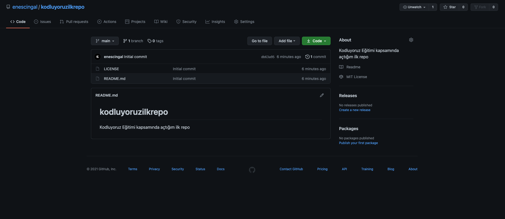

#  kodluyoruzilkrepo


Bu repo [Kodluyoruz](http://kodluyoruz.org) Front-End Eğitiminde oluşturduğumuz ilk repo. İçerisinde bir adet README dosyası, bir adet de index.html barındırıyor.



## Installation

---


Öncelikle projeyi clonelayın. (Buraya sizin reponuzdan aldığınız link gelecek)


```
https://github.com/enescingal/kodluyoruzilkrepo.git
```
  


## Usage
Horizontal rule:

---

Projeyi cloneladıktan sonra Visual Studio Code programında açınız.

Linux için:

```
cd kodluyoruzilkrepo
code . 
```
## Contributing
---


Pull requestler kabul edilir. Büyük değişiklikler için, lütfen önce neyi değiştirmek istediğinizi tartışmak için bir konu açınız.

## License
---


[MIT](
https://choosealicense.com/licenses/mit/)
